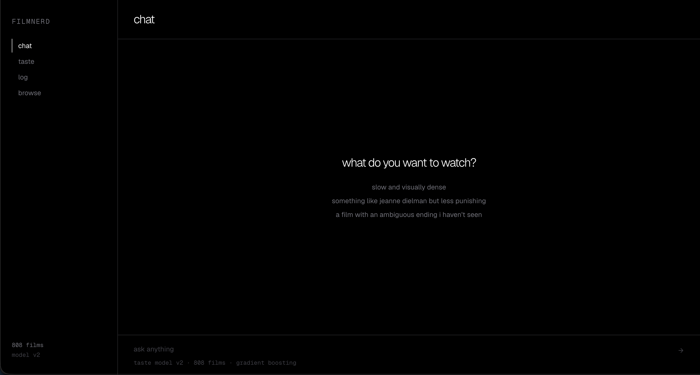
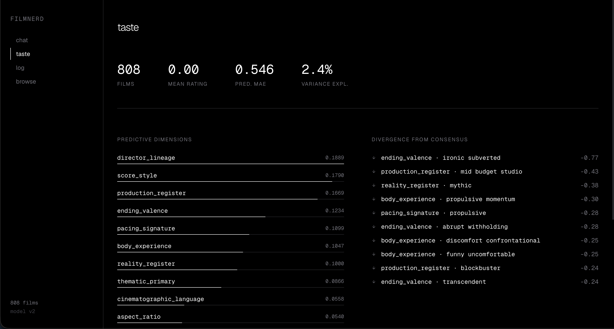
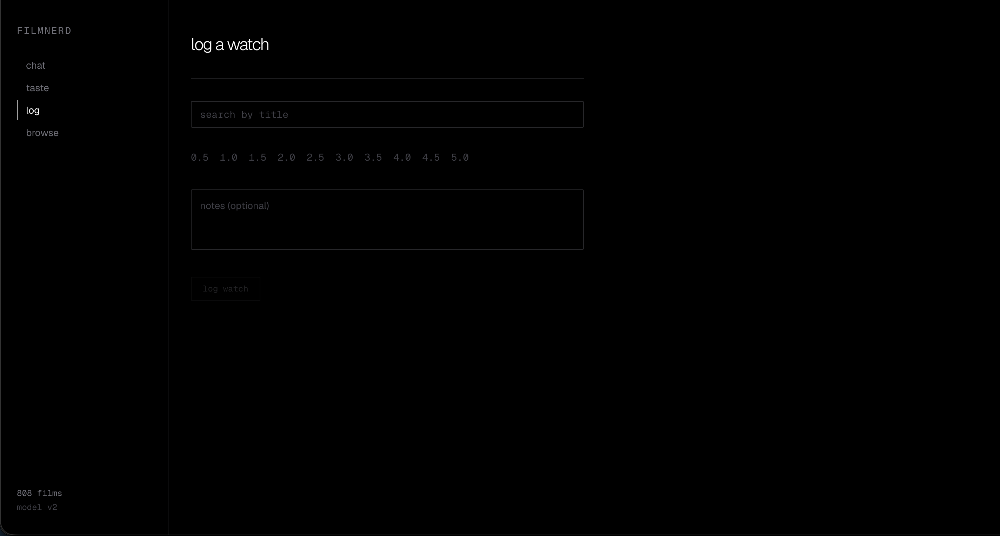
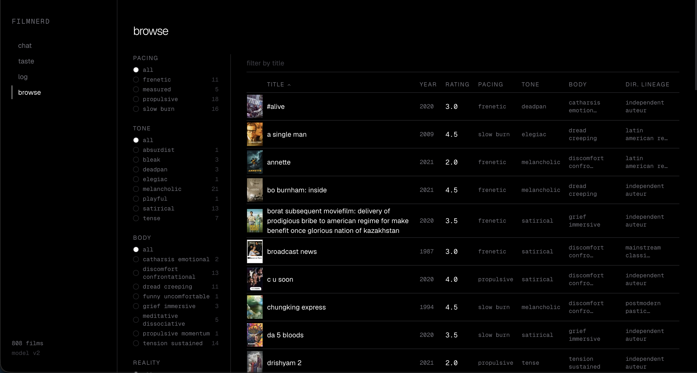

# Film Taste Intelligence Engine

A personal film intelligence system that decomposes your taste into measurable craft dimensions, builds a knowledge graph of cinematic influences, and predicts your star rating for any unseen film — evaluated against your own future ratings as ground truth.

Built for one user. Accuracy compounds the more films you watch.

---

## Architecture at a Glance

```
Letterboxd CSV
     │
     ▼
[Ingestion Pipeline] ──▶ enriched_films.json  (TMDB metadata)
     │
     ▼
[Craft Annotator]    ──▶ data/cache/annotations/{tmdb_id}.json
     │                   (20 dimensions per film via LM Studio)
     ├──────────────────▶ [Qdrant Index]  (vector similarity)
     │
     ▼
[Knowledge Graph]    ──▶ data/processed/graph.json
     │                   (3,505 nodes · 10,574 edges)
     │
     ▼
[Taste Model]        ──▶ data/processed/taste_profile.json
     │                   (4-model zoo · best: random_forest · MAE 0.546)
     │
     ├──▶ [LangGraph Agent]    ──▶ Recommendations
     ├──▶ [Prediction Engine]  ──▶ Predicted star ratings
     └──▶ [Ground Truth Logger]──▶ data/processed/predictions.db
```

---

## Quick Start

**Prerequisites:** [uv](https://docs.astral.sh/uv/), [LM Studio](https://lmstudio.ai) (local LLM server), [Qdrant](https://qdrant.tech) (Docker), [TMDB API key](https://www.themoviedb.org/settings/api).

```bash
git clone https://github.com/YOUR_USERNAME/yesiamafilmnerd
cd yesiamafilmnerd
uv sync

cp .env.example .env
# Fill in: TMDB_API_KEY, LM_STUDIO_MODEL, LANGFUSE_* keys
```

Start dependencies:

```bash
# Qdrant
docker run -p 6333:6333 qdrant/qdrant

# LM Studio — load your model, then enable Local Server on port 1234
```

---

## Run FilmNerd UI

### Option A — Start UI + API together (recommended)

From the project root:

```bash
bash start.sh
```

This starts:

- UI at `http://localhost:3000`
- API at `http://localhost:8000`

### Option B — Run only the UI (frontend dev mode)

```bash
cd filmnerd-ui
npm install
npm run dev
```

Then open `http://localhost:3000`.

If you use pnpm:

```bash
cd filmnerd-ui
pnpm install
pnpm dev
```

Note: the UI expects the backend API on port 8000 for chat and recommendation features.

---

## UI

### Chat

Ask for films in natural language — by mood, craft style, or by referencing a specific film. The agent resolves your query into craft dimensions, retrieves candidates from the vector index, and streams back recommendations with explanations grounded in your taste profile.



### Taste

Your decomposed taste profile at a glance. Shows the predictive dimensions with the highest weight, your divergence from consensus ratings per dimension value, and top-level model stats (MAE, variance explained, films trained on).



### Log

Search TMDB by title, pick a star rating (0.5–5.0), add optional notes, and submit. Triggers the enrichment and annotation pipeline for new films and updates the corpus.



### Browse

Filterable table of your full 808-film corpus. Filter by pacing, tone, body experience, and reality register. Columns show year, your rating, and key craft dimensions at a glance.



---

## Environment Variables

```bash
# .env
TMDB_API_KEY=your_key_here

LM_STUDIO_BASE_URL=http://localhost:1234/v1
LM_STUDIO_MODEL=qwen/qwen3.5-9b         # exact model ID from LM Studio
LM_STUDIO_EMBED_MODEL=nomic-embed-text-v1.5

QDRANT_URL=http://localhost:6333

# Langfuse observability (optional — traces silently disabled if blank)
LANGFUSE_PUBLIC_KEY=pk-lf-...
LANGFUSE_SECRET_KEY=sk-lf-...
LANGFUSE_BASE_URL=http://localhost:3000

# For DeepEval recommendation quality metrics
OPENAI_API_KEY=sk-...
```

---

## Step-by-Step Pipeline

### 1 — Export Letterboxd Data

In Letterboxd: **Settings → Import & Export → Export Your Data**.

Unzip the download and copy into the project:

```bash
cp ~/Downloads/letterboxd-export/ratings.csv  data/raw/ratings.csv
cp ~/Downloads/letterboxd-export/reviews.csv  data/raw/reviews.csv
```

### 2 — TMDB Enrichment

Fetches crew (director, cinematographer, editor, writer, composer), genres, runtime, language, and production metadata for every film in your export. Retries failed lookups once.

```bash
python -m src.enrichment.run_enrichment
# → data/processed/enriched_films.json
# Output: Enrichment complete: 808 succeeded, 11 failed
```

### 3 — Craft Annotation

Sends each enriched film to LM Studio (Qwen 3.5) via Instructor structured outputs, producing a typed `CraftAnnotation` object across 20 dimensions. Safe to interrupt — results are cached per TMDB ID and skipped on resume.

```bash
python -m src.annotation.run_annotation
# → data/cache/annotations/{tmdb_id}.json  (one file per film)
# Monitor progress live:
streamlit run src/monitoring/dashboard.py
```

**The 20 craft dimensions:**

| Dimension | What it captures |
|---|---|
| `narrative_time` | Linear / non-linear / fragmented / cyclical / parallel |
| `pacing_signature` | Felt tempo: slow\_burn → frenetic |
| `point_of_view` | Whose perspective organises the narration |
| `ending_valence` | Emotional register of the resolution |
| `tone_primary` / `tone_secondary` | Dominant and secondary emotional register |
| `reality_register` | Relationship to physical reality (naturalistic → mythic) |
| `moral_complexity` | How the film handles ethical questions |
| `character_legibility` | Psychological transparency of characters |
| `dialogue_density` | Amount and function of dialogue |
| `cinematographic_language` | Visual language and camera style |
| `colour_palette` | Dominant colour approach |
| `aspect_ratio` | Frame shape |
| `score_style` | Music approach |
| `editor_signature` | Editing rhythm and style |
| `world_building_depth` | How much the film constructs its world |
| `genre_subversion` | Degree of genre deconstruction |
| `thematic_primary` / `thematic_secondary` | Dominant and secondary thematic concerns |
| `director_lineage` | Cinematic tradition the director belongs to |
| `body_experience` | Physical sensation the film produces in the viewer |
| `production_register` | Budget and production scale |

### 4 — Knowledge Graph

Builds a NetworkX `DiGraph` from enriched crew data. Each director, cinematographer, editor, writer, and composer becomes a node; `DIRECTED`, `SHOT`, `EDITED`, `WROTE`, `COMPOSED`, `COLLABORATED_WITH`, and `INFLUENCED_BY` edges are drawn from TMDB data and a curated seed file.

```bash
python -m src.graph.run_graph
# → data/processed/graph.json
# Current graph: 3,505 nodes · 10,574 edges
```

Node type breakdown: 808 films, 567 directors, 514 cinematographers, 530 editors, 628 writers, 458 composers.

### 5 — Taste Decomposition Model

Trains a 4-model zoo (Ridge, ElasticNet, Gradient Boosting, Random Forest) on the craft annotation features against your divergence-from-mean ratings. Selects the best model by MAE and writes a taste profile.

```bash
python -m src.taste.run_taste
# → data/processed/taste_profile.json
```

Sample output:
```
Best model:          random_forest
Trained on:          808 films
Prediction MAE:      0.546 ★
Top dimensions:      director_lineage, score_style, production_register,
                     ending_valence, pacing_signature, body_experience

Rates BELOW consensus: ending_valence=ironic_subverted (-0.77 ★)
                       production_register=mid_budget_studio (-0.43 ★)
                       reality_register=mythic (-0.38 ★)
```

### 6 — Build the Qdrant Vector Index

Embeds each craft annotation as a 768-dim vector (nomic-embed-text-v1.5) and upserts into Qdrant with all craft fields as filterable payload.

```bash
python -m src.agent.qdrant_index
# Creates collection 'films' in Qdrant and indexes all 808 annotations
```

---

## Features

### Recommendations

The LangGraph agent runs a 4-node pipeline:

```
rag_retrieve → graph_traverse → rerank_by_taste → synthesize
```

1. **rag_retrieve** — semantic search over Qdrant, separating unseen from high-rated seen films
2. **graph_traverse** — multi-hop traversal: direct filmography → INFLUENCED\_BY hops → collaborator films
3. **rerank_by_taste** — scores candidates by divergence profile alignment, merges sources, sets confidence
4. **synthesize** — LM Studio + Instructor structures 3 recommendations with craft-specific explanations

```bash
python -m src.agent.run_recommender "something slow and visually dense, formally rigorous"
python -m src.agent.run_recommender "melancholic, sparse dialogue, ambiguous ending"

# With a predicted rating for a specific TMDB ID:
python -m src.agent.run_recommender "formally experimental" --predict 11216
```

### Taste Profile Dashboard

```bash
streamlit run src/monitoring/taste_dashboard.py
```

Shows: model comparison table, top predictive dimensions, divergence from consensus, prediction accuracy charts (scatter of predicted vs actual, cumulative MAE over time).

### Rating Predictions

```bash
# Predict rating for a single film (by TMDB ID)
python -m src.prediction.run_prediction --tmdb-id 11216

# Batch predict all annotated unseen films
python -m src.prediction.run_prediction --limit 50

# Re-predict (overwrite existing)
python -m src.prediction.run_prediction --tmdb-id 11216 --overwrite
```

### Ground Truth Logger

After watching a predicted film, log the actual rating to update the MAE tracker.

```bash
# List films awaiting actual ratings
python -m src.evaluation.run_logger pending

# Log a real rating after watching
python -m src.evaluation.run_logger log --tmdb-id 11216 --rating 4.0

# View accuracy report
python -m src.evaluation.run_logger report
```

Sample report:
```
Predictions total : 23
With actual rating: 8
MAE               : 0.438 ★
Within ½ ★        : 62.5%
Within 1 ★        : 87.5%
```

### Evaluation (DeepEval)

Measures recommendation quality against three metrics: Faithfulness, Answer Relevancy, Contextual Recall. Requires an OpenAI API key for the evaluation LLM.

```bash
python -m src.evaluation.run_eval "something slow and formally experimental"
```

---

## Dataset Publishing

Exports the 808-film craft annotation dataset as JSONL, stripping personal ratings and review text before publication.

```bash
# Export locally
python -m src.dataset.run_publisher
# → data/export/film_craft_annotations.jsonl
# → data/export/README.md  (Hugging Face dataset card)

# Push to Hugging Face Hub
python -m src.dataset.run_publisher --push --repo yourusername/film-craft-annotations
```

The exported dataset contains: TMDB metadata, all 20 craft dimension annotations, annotation confidence scores, crew (director, cinematographer, editor, writer, composer), genres, runtime, language, and consensus ratings. Personal ratings and review text are not included.

---

## Observability

All recommendation sessions and predictions are traced via Langfuse. Spans are created for each LangGraph node (`rag_retrieve`, `graph_traverse`, `rerank_by_taste`, `synthesize`) and for each `predict_rating` call. Metadata logged per span: hit counts, candidate scores, model used, titles recommended, and reasoning text.

Configure by filling in `LANGFUSE_*` keys in `.env` and running a local Langfuse instance:

```bash
# Quick local Langfuse via Docker Compose
# See: https://langfuse.com/docs/deployment/local
docker compose up langfuse
```

Tracing is silently disabled when keys are blank — nothing breaks if Langfuse is not running.

---

## Project Structure

```
src/
├── ingestion/        # Letterboxd CSV parser, FilmRecord models
├── enrichment/       # TMDB async enrichment, store
├── annotation/       # CraftAnnotation schema, LM Studio annotator, store
├── graph/            # NetworkX graph builder, models, store
├── taste/            # Feature encoder, 4-model taste decomposition
├── agent/            # LangGraph agent, Qdrant index, graph retriever, CLIs
├── prediction/       # LLM-based rating prediction engine, SQLite store, CLIs
├── evaluation/       # DeepEval suite, ground truth logger, MAE report
├── dataset/          # JSONL exporter, Hugging Face publisher
├── monitoring/       # Annotation pipeline dashboard, taste profile dashboard
└── observability/    # Langfuse singleton, @observe wiring
data/
├── raw/              # ratings.csv, reviews.csv (your Letterboxd export)
├── cache/annotations/# Per-film annotation JSON (tmdb_id.json)
└── processed/        # enriched_films.json, graph.json, taste_profile.json,
                      # predictions.db
data/export/          # film_craft_annotations.jsonl (public dataset)
```

---

## Current Taste Model Results

Trained on 808 films. Best model: `random_forest` (MAE 0.546 ★).

**Top 8 predictive dimensions** (ridge weight magnitude):

| Dimension | Weight |
|---|---|
| director\_lineage | +0.1889 |
| score\_style | +0.1790 |
| production\_register | +0.1669 |
| ending\_valence | +0.1234 |
| pacing\_signature | +0.1099 |
| body\_experience | +0.1047 |
| reality\_register | +0.1000 |
| thematic\_primary | +0.0866 |

**Largest divergences from consensus:**

| Dimension value | Your rating vs. consensus |
|---|---|
| ending\_valence = ironic\_subverted | −0.77 ★ |
| production\_register = mid\_budget\_studio | −0.43 ★ |
| reality\_register = mythic | −0.38 ★ |
| body\_experience = propulsive\_momentum | −0.30 ★ |
| pacing\_signature = propulsive | −0.28 ★ |
| ending\_valence = abrupt\_withholding | −0.28 ★ |
